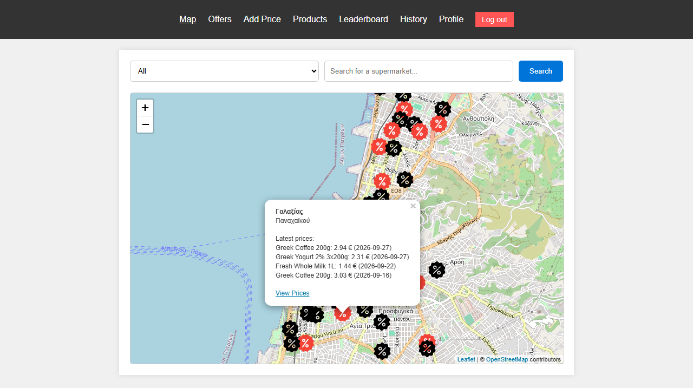
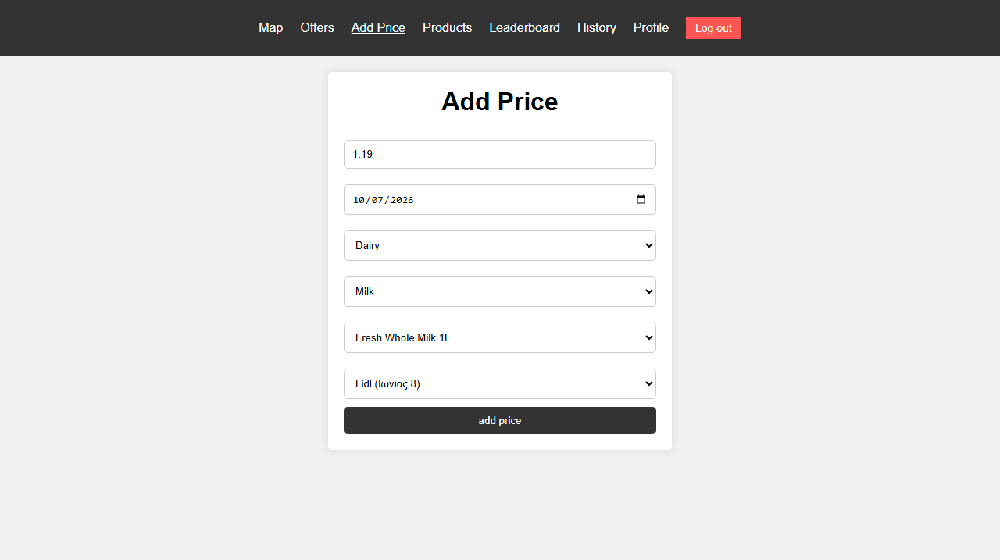
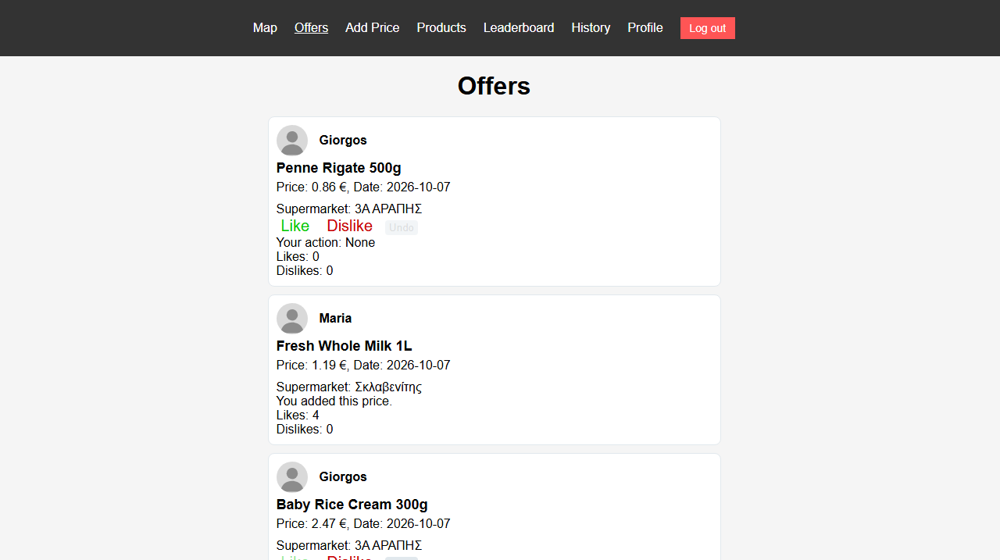
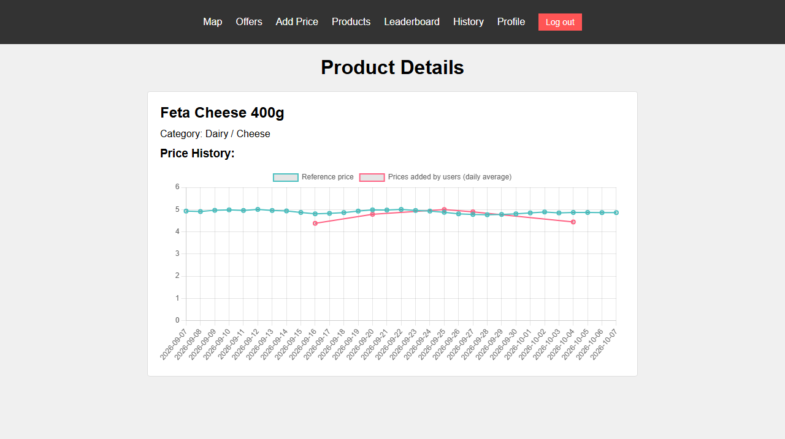
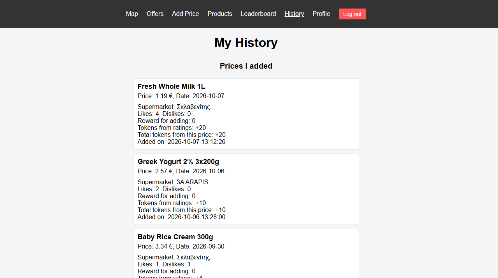
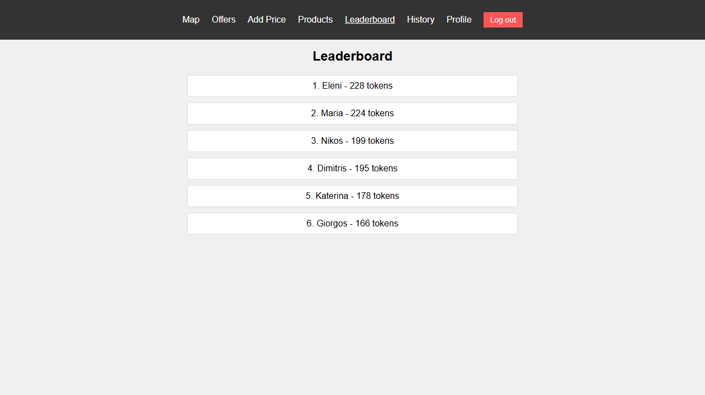
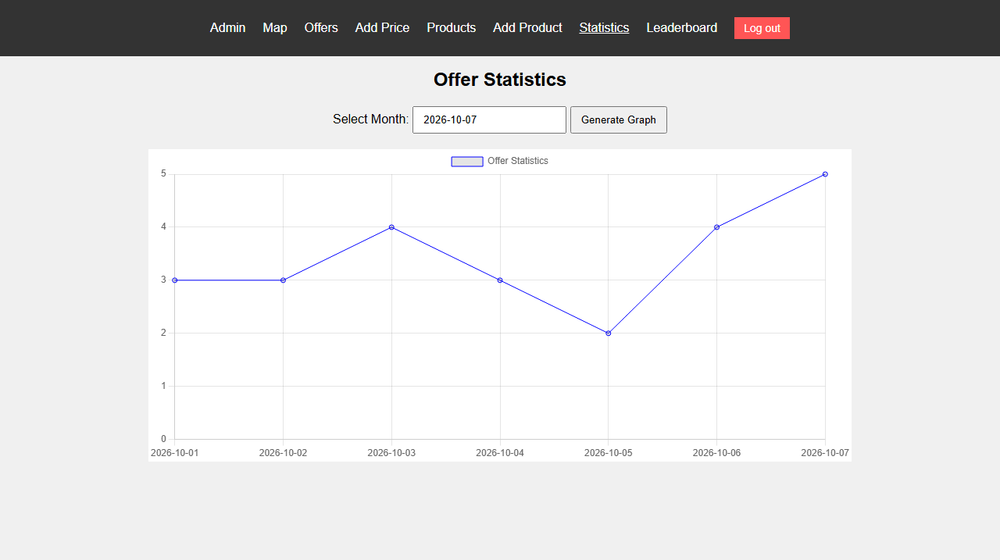

# Supermarket Price Comparison

A crowdsourced price-tracking web app for the supermarkets of Patras, Greece. Users report the prices they see in a store, other users rate those reports, and good reports earn tokens. Built with Node.js, Express, EJS and MySQL, with a Leaflet map and Chart.js charts.



---

## Features

### For users

- **Map** of 62 supermarkets on OpenStreetMap. Stores with reported prices get a different marker; clicking one shows its latest prices and a link to all prices reported for that store. Filter by product category or search by store name as you type. If you share your location, the map shows where you are and how far each store is.
- **Add a price** for a product at a store, choosing category, subcategory and product from linked dropdowns.
- **Offers feed** with every reported price. Like, dislike or undo your rating. You cannot rate your own reports.
- **Products** catalogue with category filters, live search and a price-history chart per product (reference price against the daily average of user reports).
- **Leaderboard** of users ranked by tokens, with numbered pages.
- **History** of the prices you added (with the tokens each one earned) and the prices you rated.
- **Profile** with editable name, email and photo.
- **Phone screens**: the layout adapts to narrow screens, and the menu scrolls sideways.

### For administrators

- Add products and rename them.
- Report prices like a user, without earning tokens.
- Delete wrong or fake price reports.
- Statistics chart: number of reports per day for a chosen month.

### Tokens

| Event | Tokens |
|---|---|
| New account | 100 to start |
| Reporting a price more than 20% below the previous day's average for that product | +50 |
| Otherwise, more than 20% below the previous week's average | +20 |
| No user reports in the previous week, and more than 20% below the product's reference price | +20 |
| Another user likes your report | +5 |
| Another user dislikes your report | -1 |

A report earns a reward at most once per user, product and day, counting both the day of the price and the day it was submitted, and a price below half of the value it is compared with is treated as unrealistic and earns nothing. The averages leave out your own earlier reports, and a price cannot be dated in the future. Changing or undoing a rating reverses its effect on the author's balance.

On the first day of each month a pool of new tokens (80 for every registered user) is shared between the users, in proportion to what each one earned from reports and ratings during the month that just ended. Users who earned nothing get nothing from the pool.

---

## Screenshots

| Adding a price | Offers feed |
|---|---|
|  |  |

| Price history of a product | A user's history |
|---|---|
|  |  |

| Leaderboard | Statistics for administrators |
|---|---|
|  |  |

---

## Tech stack

| Layer | Technology |
|---|---|
| Server | Node.js, Express 4 |
| Views | EJS for the profile and edit pages, static HTML for the rest |
| Frontend | Plain JavaScript and CSS, Leaflet, Chart.js, flatpickr |
| Database | MySQL 8 through `mysql2` (connection pool, parameterised queries, transactions) |
| Auth and security | `express-session` with sessions stored in MySQL, bcrypt, Helmet with a content security policy, `express-rate-limit` on login and registration |
| Uploads | Multer in memory, files checked by their signature bytes |
| Testing | Node's built-in test runner, driving the app over HTTP against a seeded database |

---

## Getting started

### Prerequisites

- Node.js 22 or newer
- MySQL 8

### 1. Install

```bash
git clone https://github.com/theopap7/supermarket-price-comparison.git
cd supermarket-price-comparison
npm install
```

### 2. Configure

```bash
cp .env.example .env
```

Then edit `.env`:

| Variable | Purpose |
|---|---|
| `DB_HOST`, `DB_USER`, `DB_PASSWORD` | MySQL connection |
| `DB_NAME` | Database to use; the seed script creates it if it does not exist |
| `PORT` | Port for the web server |
| `SESSION_SECRET` | Any long random string; the server refuses to start without it |
| `DEMO_USER_PASSWORD`, `DEMO_ADMIN_PASSWORD` | Optional passwords for the demo accounts; when empty, the seed script generates random ones |

### 3. Create the database and demo data

```bash
npm run seed
```

This creates the tables from [`db/schema.sql`](db/schema.sql) and fills them with 6 categories, 21 products, 62 supermarkets, demo accounts, 31 days of reference prices and 90 user reports with ratings. Dates are generated relative to the day you run it, so the charts always have recent data. When it finishes it prints the passwords of the demo accounts.

If the database already has tables the script stops. To delete them and start again:

```bash
npm run seed -- --reset
```

### 4. Run

```bash
npm start
```

Open `http://localhost:3001` (or the port you set). `npm run dev` restarts the server when a file changes.

### Demo accounts

| Role | Email | Password |
|---|---|---|
| User | `maria@example.com`, `nikos@example.com`, `eleni@example.com`, `giorgos@example.com`, `katerina@example.com`, `dimitris@example.com` | `DEMO_USER_PASSWORD` |
| Administrator | `admin@example.com` | `DEMO_ADMIN_PASSWORD` |

If you leave those two variables empty in `.env`, `npm run seed` picks a random password for the users and another for the administrator and prints them. They are not stored anywhere else, so note them down or seed again with `--reset`.

You can also register a new account from the login page.

---

## Testing

```bash
npm test
```

74 tests in 8 files cover authentication, sessions and page access, the catalogue and map data, adding prices and the reward rules, ratings and tokens, the monthly token distribution, profiles and photo uploads, the admin actions and the login rate limit. Each file starts the app on a free port and makes real HTTP requests.

The tests rebuild a separate database on every run, `supermarket_test` by default (set `TEST_DB_NAME` to change it). They refuse to run if that name is the same as `DB_NAME`, so they cannot wipe the database you use for the app.

---

## Project structure

```
├── server.js            Starts the server and the monthly job
├── app.js               Express setup: security headers, session, routers, error handling
├── config.js            Environment settings and constants
├── db.js                Connection pool and transaction helper
├── utils.js             Small helpers shared by the routers
├── middleware/          Session store, session and role checks, rate limiters, photo upload
├── routes/              One router per area: pages, auth, profile, catalogue, offers, leaderboard, admin
├── jobs/                Monthly token distribution
├── db/
│   ├── schema.sql       Table definitions
│   ├── seed.js          Demo data generator
│   └── supermarkets.json  Stores exported from OpenStreetMap
├── pages/               HTML pages, served only after the session check
├── views/               EJS templates
├── tests/               Test files and their shared helpers
├── screenshots/         Images used in this README
└── public/
    ├── css/
    ├── js/              One script per page, plus nav.js for the shared menu
    ├── img/
    └── uploads/         Profile photos (not committed)
```

## Database

Ten tables:

| Table | Holds |
|---|---|
| `users`, `administrators` | Accounts; passwords are bcrypt hashes |
| `categories`, `subcategories`, `products` | The product catalogue |
| `supermarkets` | Stores with coordinates and address |
| `prices` | Reference price of each product per day |
| `offers` | Prices reported by users, with the reward each report earned |
| `ratings` | One like or dislike per user and report |
| `sessions` | Login sessions, so they survive a server restart |

---

## Known limitations

- The monthly token distribution runs inside the server process, so a month is skipped if the server is not running at midnight on the first day.
- The session cookie is not marked `secure`. Set that in `app.js` before serving the app over HTTPS.

## Credits

Map tiles and store data © [OpenStreetMap](https://www.openstreetmap.org/copyright) contributors, available under the Open Database License. The map uses [Leaflet](https://leafletjs.com/), the charts use [Chart.js](https://www.chartjs.org/). The background photo of the login page is by [Ananthu Ganesh](https://unsplash.com/photos/shopping-cart-filled-with-items-gWzmrNBd17E) on Unsplash.
